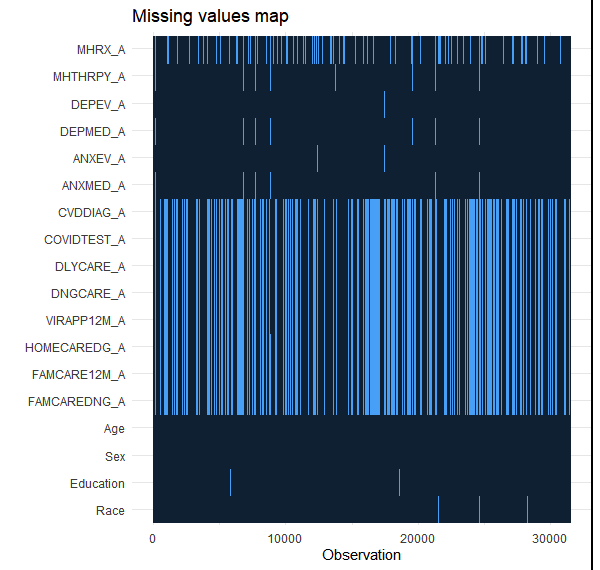
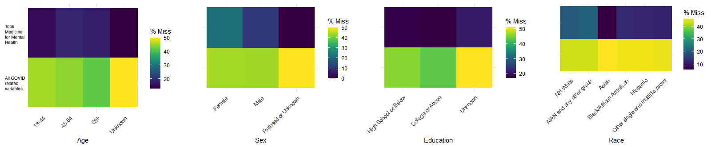
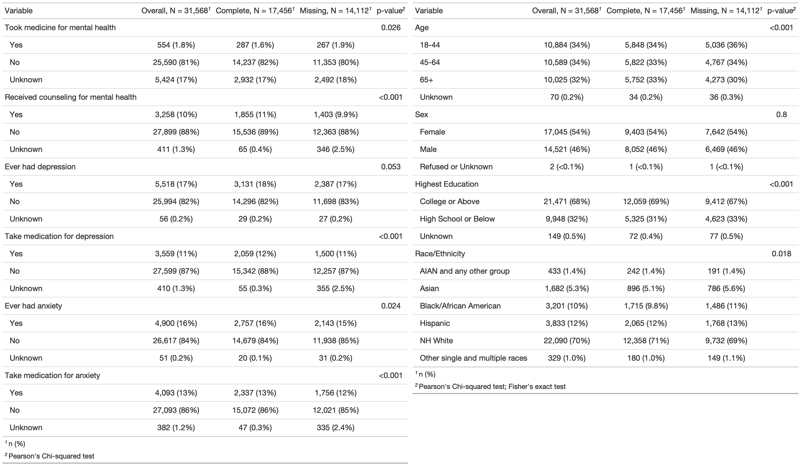
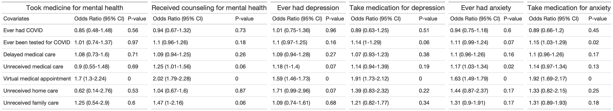
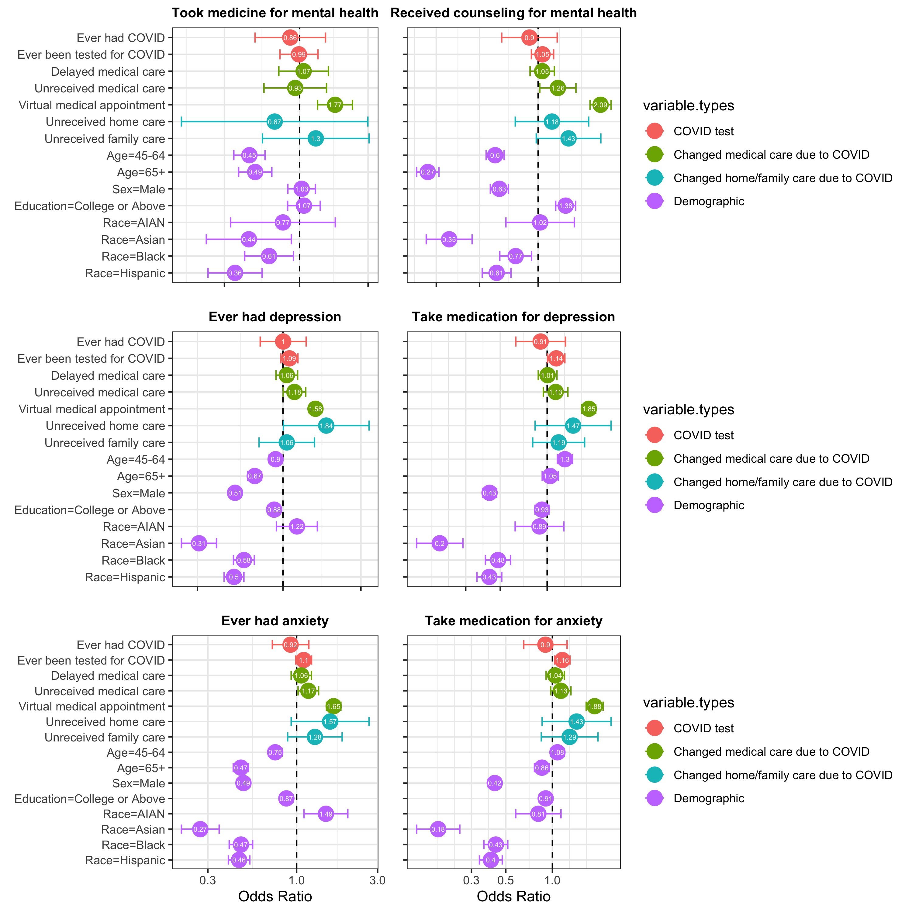

### Background

The novel coronavirus disease 2019 (COVID-19) has caused 47.4 million cases in the United States. As many measures were taken to stop the spread of the pandemic, there have been great changes in the lifestyles of people, including ways of working, studying, getting healthcare, etc. In addition to physical health, economic, and social implications, the impact of COVID-19 on psychological aspects has also been observed in daily life and recent literature.$^{[1]}$ This impact can be attributed to fear of being infected, loneliness during quarantine, as well as some rising racial discrimination due to the outbreak of the disease. Understanding how COVID-19 can impact the mental health of the population in the United States might have important implications on the reason and thus the treatment of mental diseases. Therefore, we would like to investigate the associated factors of mental health problems during 2020 in the United States and, with a specific focus on COVID-19 related health status.

### Methods

**Study population:** Our study population comes from the 2020 National Health Interview Survey (NHIS) program, a large, observational, cross-sectional survey study that targets the noninstitutionalized civilian resident population of the United States.$^{[2]}$ The main objective of the NHIS is to monitor the health of the United States population through the collection and analysis of data on a broad range of health topics. There are 31,568 interviews in total.

**Outcomes:** The binary outcome variables include medical care received for mental health and medication for depression and anxiety. The corresponding original questions in the survey have categorical answers “Yes”, “No”, “Refused”, “Not Ascertained”, “Don't Know”; the three categories other than “Yes” or “No” were all treated as missing values. Specifically, the corresponding questions in the surveys were: 1) whether the participants took prescription medication for mental health problems during the past 12 months (MHRX_A); 2) whether the participants received counseling or therapy from mental health professionals such as a psychiatrist, psychologist, psychiatric nurse, or clinical social worker (MHTHRPY_A); 3) whether the participants ever had depression (DEPEV_A); 4) whether the participants take prescription medication for depression (DEPMED_A); 5) whether the participants ever had anxiety (ANXEV_A); 6) whether the participants take prescription medication for anxiety (ANXMED_A).

**Main Predictors of Interest: COVID-related:** Our main goal was to examine the relationship between mental health outcomes and the following COVID-related predictors: 1) whether the participants ever had or are likely to have COVID-19 (CVDDIAG_A); 2) whether the participants have ever been tested for COVID (COVIDTEST_A); 3) whether the participants delayed getting medical care due to coronavirus pandemic (DLYCARE_A); 4) whether the participants needed medical care for something other than coronavirus, but did not get it due to the pandemic (DNGCARE_A); 5) whether the participants had an appointment with health professionals by video or by phone due to the pandemic in the past 12 months (VIRAPP12M_A); 6) whether the participants needed care at home from health professionals but did not get it due to the pandemic (HOMECAREDG_A); 7) whether the participants needed care at home from friends or family members but did not get it due to the pandemic (FAMCAREDNG_A). All of these predictors included the same categories as the outcomes and were treated as binary in the same way (i.e. the three categories other than “Yes” or “No” were all treated as missing values).

**Other Potential Factors: Demographics:** Other potential factors that might be associated with mental health status included age (continuous, AGEP_A), sex (binary, SEX_A), highest education attainment (categorical, EDUC_A), and race/ethnicity (categorical, HISPALLP_A). For the continuous age, those aged 85 or above were reported as 85, and numbers above 85 represented “Refused”, “Not Ascertained”, “Don't Know” instead of the real age; to better incorporate this information, based on the criteria that many NHIS studies have been using, we categorized age into four groups: 18-44, 45-64, 65+, unknown. For the highest education, there were originally more than ten categories, and we re-categorized them into three groups for simplicity: high school or below, College or Above, unknown. For sex and race/ethnicity, we also combined all the categories indicating unsure answers into a new category unknown. To keep more observations in use, we included all those who indicated “unknown” in the demographic features, but we would not report or interpret those covariates for our results.

**Statistical Analyses:** For each of the six binary outcome variables, respectively, we used multiple logistic regression analysis to see whether the main predictors of interest are significantly associated with it. In a stepwise manner, we also controlled for the potential factors (i.e. sociodemographic features). The final model used for interpretation and visualizations included all variables. All statistical analyses were weighted to account for the cluster sampling method of NHIS and were performed in RStudio, using the “srvyr” package.$^{[3]}$ Results were visualized using the *ggplot2* and *gtsummary* package.$^{[4]}$$^{[5]}$ Due to the large subgroup with missing values, we performed a missing value analysis to test the generalizability of the data using chi-square tests. Many variables are significantly different across complete and missing cases, indicating that our data is likely not missing at completely random (Table 1). The missing values map showed that a certain number of observations are having missing entries in all of the COVID-related predictors simultaneously (Figure 1).$^{[6]}$ We also plotted the percentages of missing values in COVID-related predictors factored by demographics and found that missing values range from 30% to 50% (Figure 2).$^{[7]}$

{width=20%} {width=80%}

Figure 1: Missing Values Map $\quad\quad$ Figure 2: Missing Values’ Distribution by demographics

{width=70%}

Table 1: Descriptive Statistics from Complete and Missing data

**Missing Data Imputations:** Due to the pattern of missing values and their abundance, we decided to impute the missing values before analysis. To avoid the potential loss of data, we decided to impute the missing data in our predictors of interest using package *Hmisc*:$^{[8]}$ each COVID-related predictor was imputed five times. Imputed values were then stored in five different datasets, respectively. We fitted models on each of the datasets and then used the “pool” function from package *mice* to combine the estimates from the models that fit on these datasets.$^{[9]}$ The R-squared values for predicting non-missing values for each variable are from around 10% to 30%.

### Results

{width=80%}

Table 2. Unadjusted analysis for mental health outcomes with COVID-related predictors

#### Unadjusted Analysis 

As shown in Table 2, virtual medical appointment due to COVID is a significant predictor for all the mental health outcomes (p<0.05). There are also some other significant patterns. People who were unable to receive medical care because of the COVID pandemic are 1.17 times more likely to have anxiety, compared to those who could receive medical care despite COVID (95% CI [1.03, 1.34], p<0.05) (Table 2). In addition, people ever tested for COVID are 1.15 times more likely to take medication for anxiety (95% CI [1.03, 1.29], p<0.05). 

#### Adjusted Analysis

After adding demographic variables, the following demographic variables show a somewhat consistent relationship across the six mental health outcomes. Minority racial groups including Asian, Black, and Hispanics are less likely to have mental health issues compared to Non-Hispanic White. People older than 45 years old are also less likely to suffer from these psychological problems, except for taking medication for depression, compared to those aged 18-44. Males are less likely to suffer from anxiety or depression and take medication for these conditions compared to females.

**Took medicine for mental health problems:**
People who had virtual medical appointments due to COVID are 1.77 times more likely to take medicine for mental health (95% CI [1.33, 2.34], p<0.05). People who are 45 years or older are less likely to take medicine for mental health, compared to the younger people (p<0.05). In addition, minority racial groups, such as Asian, Black, and Hispanic, are less likely to take medicine for mental health problems compared to White (p<0.05).

**Received counseling for mental health:**
People who had virtual medical appointments due to COVID are 2.09 times more likely to receive mental health counseling from health professionals (95% CI [1.85, 2.37], p<0.05). Interestingly, males are 0.63 times less likely to receive such therapy (95% CI [0.57, 0.70], p<0.05). Additionally, people who have college or higher degrees are 1.38 times more likely to receive mental health counseling (95% CI [1.23, 1.56], p<0.05).

**Ever had depression:**
People who had virtual medical appointments due to COVID are 1.58 times more likely to have depression (95% CI [1.45, 1.72], p<0.05). Males are 0.5 times less likely to suffer from depression (95% CI [0.47, 0.55], p<0.05). People who have college or higher degrees are 0.88 times less likely to have depression (95% CI [0.81, 0.96], p<0.05).

**Take medication for depression:**
People ever tested for COVID are 1.14 times more likely to take medication for depression (95% CI [1.01, 1.30], p<0.05). People who had virtual medical appointments due to COVID are 1.85 times more likely to take depression medicine (95% CI [1.67, 2.05], p<0.05). Males are 0.43 times less likely to take such medication (95% CI [0.38, 0.47], p<0.05). It is worth noticing that age behaves differently for this particular outcome, compared to other outcomes. People who are between 45 and 64 years old are 1.3 times more likely to take medication for depression (95% CI [1.16, 1.45], p<0.05).

{width=80%}

Figure 3. Forest Plots of Odds Ratios in Weighted Logistic Regressions [reference levels are not shown in the plot: for all the binary variables (without an equal sign in the covariate name), the reference is *no*; the reference group is *18-44* for *age*, *female* for *sex*, *high school or below* for *education*, and *Non-Hispanic Whites* for *race/ethnicity* (abbreviated as *race* in the plots)]

 
**Ever had Anxiety:**
People who were unable to receive medical care from health professionals due to the coronavirus pandemic are 1.17 times more likely to have anxiety (95% CI [1.02, 1.35], p<0.05). In addition, people who had virtual medical appointments due to COVID are 1.65 times more likely to have anxiety (95% CI [1.50, 1.82], p<0.05). Males are 0.49 times less likely to suffer from anxiety (95% CI [0.45, 0.53], p<0.05). People who have college or higher degrees are 0.87 times less likely to have anxiety (95% CI [0.79, 0.95], p<0.05). Noticeably, Native Americans/Alaska natives (AIAN) are 1.49 times more likely to have anxiety, compared to White (95% CI [1.10, 2.00], p<0.05).

**Take medication for anxiety:**
People ever tested for COVID are 1.16 times more likely to take medication for anxiety (95% CI [1.03, 1.30], p<0.05). In addition, people who had virtual medical appointments due to COVID are 1.88 times more likely to take anxiety medicine (95% CI [1.65, 2.13], p<0.05). Males are 0.42 times less likely to take such medication (95% CI [0.39, 0.47], p<0.05).

### Conclusions and Discusssions

In conclusion, people who had COVID and who did not have COVID were equally likely to have anxiety and depression, take medicine for anxiety and depression, and receive psychological counseling. Some of the subgroups of people who had tested COVID were less likely to show anxiety and depression, but more likely to take medicine for anxiety and depression. As the hospital burden increased due to rising cases, people who did not receive medical care other than COVID might have anxiety feelings. People who had virtual medical appointments in 2020 were more likely to have anxiety and depression, take medicine for anxiety and depression, and receive psychological counseling.

Regarding demographics features: compared to people aged 18 to 44, people aged 45 to 64 were more likely to take medication for depression, but were less likely to have anxiety and depression, and receive psychological counseling. People aged 65+ were less likely to have anxiety and depression, and receive psychological counseling. People with college or higher degrees were more likely to receive psychological counseling but less likely to have anxiety and depression. Compared to females, males would be less likely to have anxiety and depression, take medicine for anxiety and depression, and have psychological counseling. Native Americans/Alaska natives would be more likely to have anxiety compared to White people. Compared to Asian, Black, and Hispanic, White people were more likely to have anxiety and depression, take medicine for anxiety and depression, and receive psychological counseling. To interpret all these trends, we need to take economics instability during the pandemic into consideration. The unemployment rates increased, and people were worried about the family budget, meanwhile inflation rates rose.

Some of the results were slightly deviated from our expectations. For example, people aged 45 to 64 were less likely to have depression but took more medication for depression than people who were younger. The participants answered “Yes” to the “ever had depression” and “ever had anxiety” questions only if they had been told so by a doctor or health professionals which included experience before COVID. The outcome variables “take medication for depression” and “take medication for anxiety” are indications for current status in 2020. Therefore, the reason that they seemingly took medicine without a history of mental illness could be that the participants showed trends of anxiety or depression, but the illness was not severe, so the doctors recommended some medication to relieve the stress. Moreover, if people had received medical treatment or appointments, they would have fewer mental issues. This was different from the result of variable “virtual medical appointments”. We suspected that the variable also included online psychological counseling. For race, we were surprised that Non Hispanic Whites were more vulnerable to mental illness than racial groups who had less healthcare access during COVID, for example, Black. This could be due to that Non Hispanic Whites cared more about mental illness than other racial groups.

Regarding the limitations of our study, the dataset is susceptible to recall bias and information bias. For the imputation of the missing values, we had a relatively low R-squared, and thus the imputed data might not be accurate. Moreover, we suspected that the covariates we chose had the issues of multicollinearity. As another future step, we could also consider add interaction terms among the predictors in the multinomial logistic regression model.

Overall, people did face mental illness during the COVID-19 pandemic due to fear of contracting the virus, lack of access to healthcare, and economical instability. Our study understood the impact of COVID-19 on mental illness. With the result of the study, healthcare professionals can better guide people on mental health problems during and after the pandemic.

### References

1) Hossain MM, Tasnim S, Sultana A, Faizah F, Mazumder H, Zou L, McKyer ELJ, Ahmed HU, Ma P. Epidemiology of mental health problems in COVID-19: a review. F1000Res. 2020 Jun 23;9:636. doi: 10.12688/f1000research.24457.1. PMID: 33093946; PMCID: PMC7549174.

2) National Center for Health Statistics. Survey Description, National Health Interview Survey, 2020

3) ~ 9) Run citation('srvyr'), citation('ggplot2'), citation('gtsummary'), citation('naniar'), citation('finalfit'), citation('Hmisc'), citation('mice')  in R to get more details.